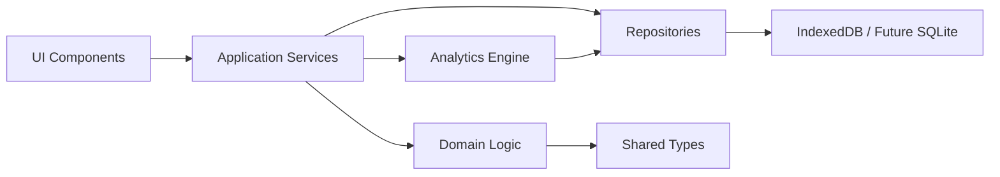
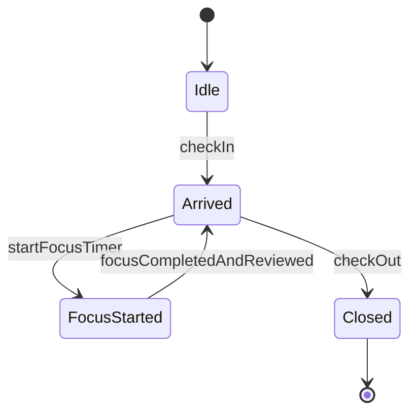
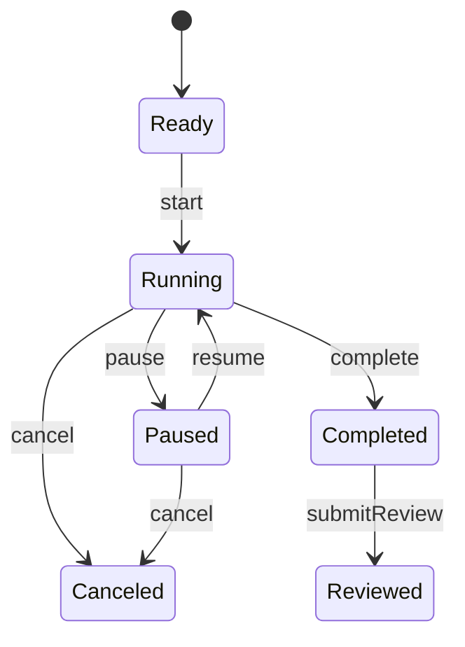

# Architecture Overview

## 当前方向

第一版已做成本地优先网页应用：

- 前端：React + TypeScript + Vite。
- 状态管理：React state 和 hooks。
- 本地存储：IndexedDB，通过 Dexie 封装。
- 图表：Recharts。
- 图标：lucide-react。
- 日期计算：date-fns。
- 测试：Vitest + Playwright。

这些选择都不阻碍后续迁移：

- Mac app：可用 Tauri 或 Electron 包装 Web UI。
- iOS/iPad app：可评估 Capacitor，或在稳定后重写原生 UI。
- 数据层：逻辑 schema 保持接近 SQLite，便于后续跨端。

## 架构分层



## 分层职责

| 层 | 职责 |
| --- | --- |
| UI Components | 页面、表单、按钮、图表，只处理展示和用户事件 |
| Application Services | 编排流程，例如开始番茄钟、完成复盘、记录睡眠 |
| Domain Logic | 纯函数规则，例如休息余额计算、启动延迟计算、统计聚合 |
| Repositories | 读写本地数据库，处理 migration |
| Analytics Engine | 从源数据生成日/周/月统计 |
| Shared Types | 统一 TypeScript 类型和输入校验 |

## 当前源码映射

| 层 | 文件 |
| --- | --- |
| UI Components | `src/App.tsx`、`src/styles.css` |
| Application Services | `src/services/app-service.ts` |
| Domain Logic | `src/domain/*.ts` |
| Repositories | `src/storage/db.ts` |
| Shared Types | `src/types.ts` |
| Defaults | `src/defaults.ts` |

## 关键状态机

### 到岗状态



### 计时器状态



## 时间处理原则

- 数据库存 UTC 时间戳。
- UI 按用户本地时区展示。
- 统计日期按用户当前本地日期切分。
- duration 类字段统一用分钟或秒，字段名必须明确，例如 `duration_minutes`。
- 启动延迟是派生值，可存缓存，但必须能从 `arrival_sessions.arrived_at` 和 `focus_sessions.started_at` 重新计算。

## 本地优先原则

- MVP 不依赖网络。
- 用户数据默认只保存在本机浏览器。
- 必须提供导出和导入能力，避免用户被锁在某个浏览器存储里。
- 未来如做同步，需要在 schema 中增加 `sync_status`、`updated_at`、`deleted_at` 等字段。

## 当前运行方式

```bash
npm install
npm run dev
```

## 当前部署方式

- 静态托管：GitHub Pages。
- 部署入口：`.github/workflows/deploy.yml`。
- 触发方式：推送到 `main` 或手动运行 workflow。
- 构建输出：Vite `dist`。
- 线上路径：`https://lapse-code.github.io/status-record/`。

验证命令：

```bash
npm run test:run
npm run lint
npm run build
npm run e2e
```

## 未来跨端考虑

- 不让 React 组件直接依赖 Dexie API。
- 所有读写通过 repository 接口。
- 业务规则用纯函数实现，方便在 Web、Mac、iOS 中复用或重写。
- 数据 schema 使用可迁移的关系型设计，不依赖浏览器特有结构。
