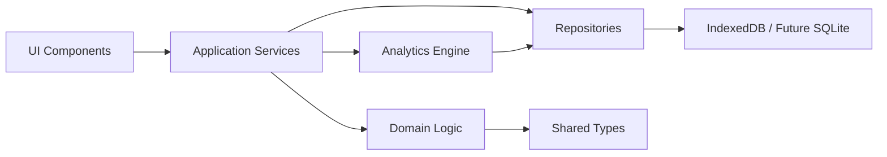
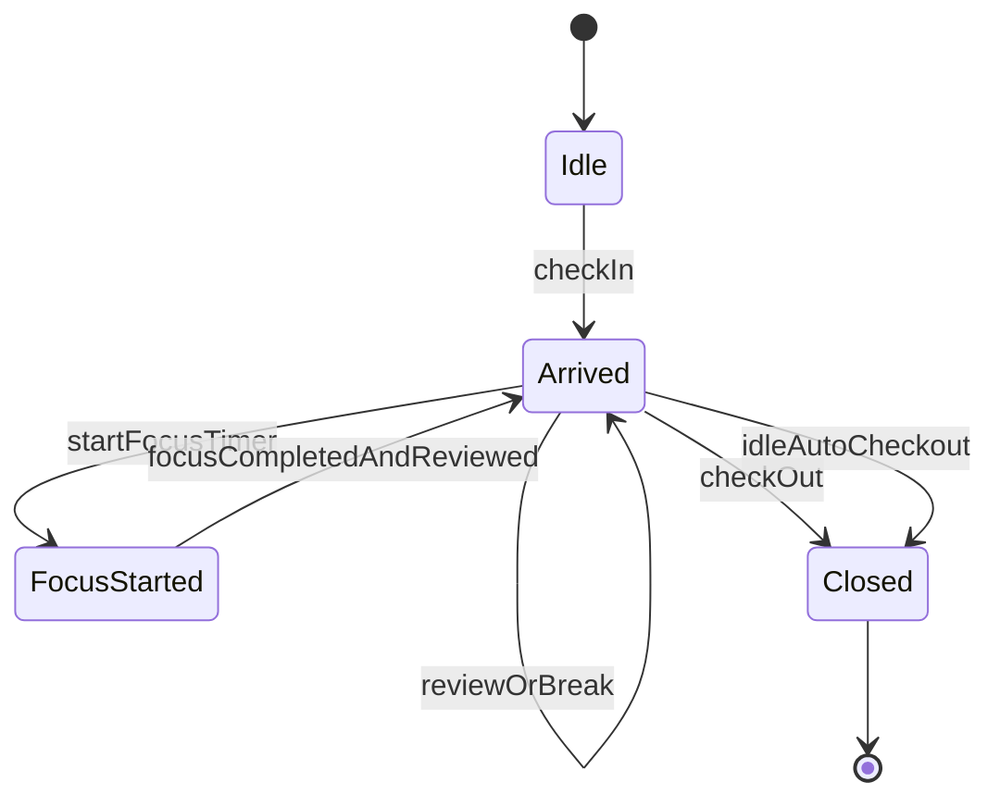
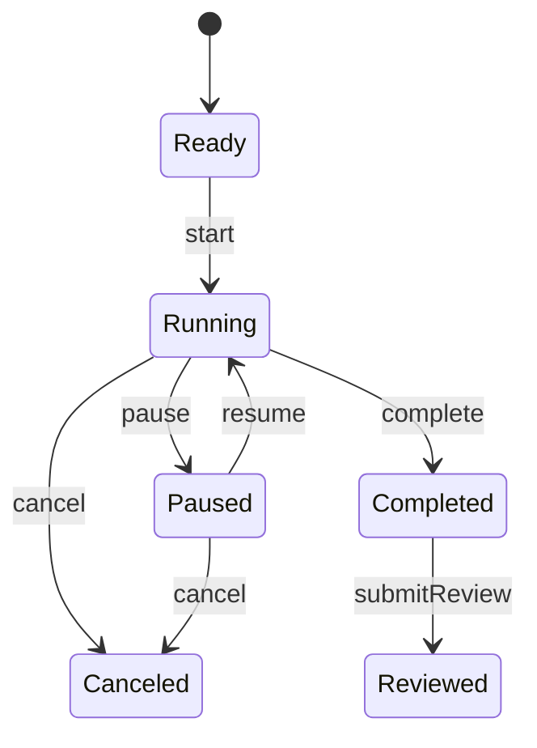

# Architecture Overview

## 当前方向

第一版已做成本地优先网页应用：

- 前端：React + TypeScript + Vite。
- 状态管理：React state 和 hooks。
- 本地存储：IndexedDB，通过 Dexie 封装。
- 图表：Recharts。
- 图标：lucide-react。
- 日期计算：date-fns + `Intl.DateTimeFormat` 时区转换。
- 测试：Vitest + Playwright。

这些选择都不阻碍后续迁移：

- Mac app：可用 Tauri 或 Electron 包装 Web UI。
- iOS/iPad app：可评估 Capacitor，或在稳定后重写原生 UI。
- 数据层：逻辑 schema 保持接近 SQLite，便于后续跨端。

## 架构分层



## 分层职责

| 层 | 职责 |
| --- | --- |
| UI Components | 页面、表单、按钮、图表，只处理展示和用户事件 |
| Application Services | 编排流程，例如开始番茄钟、完成复盘、记录睡眠 |
| Domain Logic | 纯函数规则，例如休息余额计算、拖延/启动延迟计算、统计聚合 |
| Repositories | 读写本地数据库，处理 migration |
| Analytics Engine | 从源数据生成日/周/月统计 |
| Shared Types | 统一 TypeScript 类型和输入校验 |

## 当前源码映射

| 层 | 文件 |
| --- | --- |
| UI Components | `src/App.tsx`、`src/styles.css` |
| Application Services | `src/services/app-service.ts` |
| Domain Logic | `src/domain/*.ts` |
| Repositories | `src/storage/db.ts` |
| Shared Types | `src/types.ts` |
| Defaults | `src/defaults.ts` |

## 关键状态机

### 到岗状态



### 计时器状态



## UI 刷新策略

- App 不再用单一全局 `now` 驱动所有页面。
- 倒计时、自动完成检测、休息结束检测使用 1 秒级 `timerNow`，保证番茄钟和休息提醒及时。
- 拖延保护不跟随秒级点阵重算。进入连续拖延后使用被动 `setTimeout`，页面 focus/visibility 恢复时补算；自动退岗写 `left_at = idleSince + maxDelayMinutes`，写 `updated_at = 实际补写时间`。
- Today 日点阵和周点阵使用约 30 秒级 `timelineNow`，用于当前开放到岗、运行中专注和运行中休息的低频可视化刷新。
- 统计页使用约 60 秒级 `analyticsNow`，周/月统计不会跟随倒计时秒级 tick 重算。
- 每次写入数据并重新读取 snapshot 后，会立即推进低频显示时间，保证开始、暂停、完成、复盘、手动记录、导入等操作后 UI 立即反映最新数据。
- 点阵、周点阵、统计图、睡眠面板和设置页通过 memo 和稳定回调隔离，避免倒计时每秒变化时重建大量 DOM、Recharts 图表或 288 格点阵。

## 时间处理原则

- 数据库存 UTC 时间戳。
- 参与按天归属的源记录同时保存 `local_date` 和 IANA `time_zone`，例如 `Asia/Tokyo`、`America/Los_Angeles`。
- 新记录默认使用当前设备时区；旧数据或旧备份缺少 `time_zone` 时回填为 `Asia/Tokyo`。
- 历史日点阵和周点阵按记录发生时区把 UTC 区间映射回本地分钟，不按用户当前设备时区重新解释，避免旅行后历史时间线漂移。
- Today 页的新记录会跟随当前设备时区；如果同一日期内出现多个记录时区，点阵标题显示“多时区”提示。
- duration 类字段统一用分钟或秒，字段名必须明确，例如 `duration_minutes`。
- 拖延是派生值，内部字段仍可称 `startup_delay`；可存缓存，但必须能从源时间线重新计算：到岗区间先作为拖延底色，再用休息、有效专注片段和已复盘不专注片段覆盖。不能只用 `arrival_sessions.arrived_at` 和第一条 `focus_sessions.started_at` 计算。
- `updated_at` 是元数据时间，只能用于导入、冲突判断和同步类场景；统计、点阵、拖延保护和手动记录重叠判断必须使用业务时间字段，例如 `arrived_at`、`left_at`、`started_at`、`ended_at`、`completed_at` 和有效持续时间。

## 本地优先原则

- MVP 不依赖网络。
- 用户数据默认只保存在本机浏览器。
- 必须提供导出和导入能力，避免用户被锁在某个浏览器存储里。
- 导入、导出和示例数据属于全局数据操作，不应只挂在侧栏；当侧栏操作区隐藏时，主内容区必须提供替代入口。
- 未来如做同步，需要在 schema 中增加 `sync_status`、`updated_at`、`deleted_at` 等字段。

## 当前运行方式

```bash
npm install
npm run dev
```

## 当前部署方式

- 静态托管：GitHub Pages。
- 部署入口：`.github/workflows/deploy.yml`。
- 触发方式：推送到 `main` 或手动运行 workflow。
- 构建输出：Vite `dist`。
- 线上路径：`https://lapse-code.github.io/status-record/`。

验证命令：

```bash
npm run test:run
npm run lint
npm run build
npm run e2e
```

## 未来跨端考虑

- 不让 React 组件直接依赖 Dexie API。
- 所有读写通过 repository 接口。
- 业务规则用纯函数实现，方便在 Web、Mac、iOS 中复用或重写。
- 数据 schema 使用可迁移的关系型设计，不依赖浏览器特有结构。
