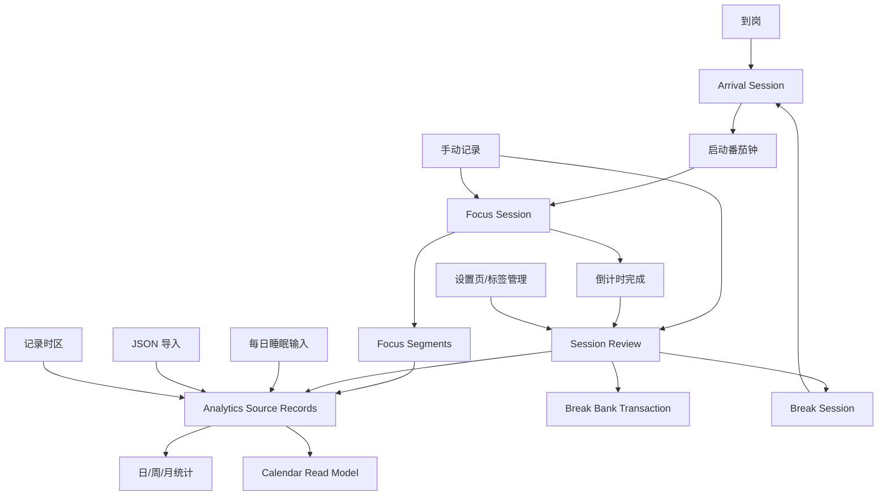

# Module Map

## 应用模块

| 模块 | 责任 | MVP 说明 |
| --- | --- | --- |
| Timer | 固定/自定义倒计时、开始、暂停、恢复、完成 | 暂停会结束当前专注片段并进入拖延；继续会在同一轮下开启新专注片段；取消不进入专注统计 |
| Manual Record | 忘记开启番茄钟时补录学习时间 | 输入开始时间、持续分钟和复盘参数，直接写入已复盘专注记录；不修改到岗记录 |
| Arrival | 到岗记录、离开记录、拖延计算、拖延保护 | 到岗表示从到岗到离开的完整工作周期；显式离开或连续拖延达到上限时关闭，到岗区间内未被专注、休息或不专注覆盖的等待时间是拖延 |
| Review | 每轮结束复盘表单 | 状态、注意力切换次数、产物、不专注原因、休息选择 |
| Break Bank | 今日休息余额累计、休息倒计时和使用 | 今日已完成番茄钟真实分钟每累计满 25 分钟增加 5 分钟；余额和进度不跨天；使用休息后进入倒计时；休息结束且余额未用完时可继续休息 |
| Labels | 标签数据模型 | 状态、产物、不专注原因都用标签系统；归档标签不再进入新复盘选择；`status-completed` 保留为专注判定状态 |
| Sleep Log | 每日睡眠记录 | 每天唯一记录，可修改 |
| Analytics | 日/周/月统计 | 从原始记录计算专注时长、拖延和标签分布；日视图生成日点阵，周/月用轻量区间汇总避免整段范围生成点阵 |
| Week Timeline | 一周日点阵 | 复用日点阵算法，按周一到周日展示 7 天 |
| Calendar | 具体事项日历 | 周视图用 00:00-24:00 时间线展示有复盘的具体事项；月视图只展示每日产物标签 |
| Time Zone | 记录发生时区 | 新记录保存当前设备 IANA 时区；旧数据缺失时区按 `Asia/Tokyo` 兼容；历史点阵按记录时区绘制 |
| Settings | 拖延保护、点阵颜色、标签配置、数据导出/导入 | 拖延自动退岗可配置；点阵状态颜色可配置；标签通过齿轮弹窗改名、改色、归档或删除；数据操作入口在侧栏和主内容备用区域中复用 |
| Storage | 本地持久化、迁移、备份导出/导入 | 保持逻辑 schema 可迁移到 SQLite |
| Notification | 倒计时结束提醒 | 番茄钟结束和休息结束触发浏览器通知、默认提示音和页面内提示 |

## 当前实现状态

| 模块 | 状态 | 入口 |
| --- | --- | --- |
| Timer | 已实现 | `src/App.tsx`、`src/services/app-service.ts` |
| Manual Record | 已实现 | `ManualRecordModal` in `src/App.tsx`、`createManualFocusRecord` |
| Arrival | 已实现 | `src/services/app-service.ts` |
| Review | 已实现 | `ReviewModal` in `src/App.tsx` |
| Break Bank | 已实现 | `src/domain/break-bank.ts`、`break_bank_transactions`、`break_sessions` |
| Labels | 已实现 | `SettingsView` in `src/App.tsx` |
| Sleep Log | 已实现 | `SleepPanel` in `src/App.tsx` |
| Analytics | 已实现 | `src/domain/analytics.ts`、`AnalyticsView` |
| Week Timeline | 已实现 | `WeekTimelineView` in `src/App.tsx` |
| Calendar | 已实现 | `src/domain/calendar.ts`、`CalendarView` in `src/App.tsx` |
| Settings | 已实现基础设置 | 点阵颜色、JSON 导出/导入、标签管理 |
| Storage | 已实现 | `src/storage/db.ts`、`src/storage/backup.ts` |
| Notification | 已实现 | `src/reminders.ts`、`notice` 状态 |
| Demo Data | 已实现 | 全局“示例数据”操作、`src/demo-data.ts` |

## 当前统计交互

- “日点阵”按 5 分钟一个点展示一天；每个点保存内部秒级状态时长和分段，主色由多数时长决定。宽容器每列 30 分钟、窄容器每列 1 小时，避免统计页出现大片空白或轴文字过密。
- 日点阵图例和 Today/Analytics 的拖延统计使用同一套真实时长汇总；UI 中“今日拖延”必须等于点阵红色真实时长总和，而不是红色点数量。
- “周点阵”按周一到周日纵向展示 7 个日点阵，支持上一周、下一周、本周和日期跳转。
- 点阵颜色默认值：红色为拖延，天蓝色为休息，绿色为专注，黄色为不专注，浅灰色为空白；用户可在设置页修改这些颜色。
- 点阵会实时纳入当前状态：到岗未专注显示拖延，运行中专注显示专注，运行中休息显示休息，暂停显示拖延，完成未复盘先显示专注，取消后撤销本轮专注颜色。
- 点阵按记录发生时区定位到本地分钟；用户切换国家或电脑时区后，历史点阵不会被重新排布。
- Today 点阵支持前一天、后一天、今天和日期输入；Analytics 日视图的日期切换统一放在统计顶部右侧。
- Analytics 日视图显示当天统计、日点阵、睡眠参数和当天记录明细；周/月视图不显示日点阵，但保留按日期选择的记录明细入口。
- Analytics 时间占比使用方案 A：专注 + 不专注 + 拖延 = 100%，休息不进入分母；这三类时长与点阵使用同一套时间覆盖规则。日视图可直接与日点阵真实状态时长对齐，周/月视图使用轻量区间汇总而不是逐日生成完整点阵。
- Calendar 页面是另一种“事情回看”视图，不参与拖延/休息统计。周视图从已复盘 focus session 的有效专注区间生成事件卡片，显示时间、产物标签和文字描述；月视图按日期聚合并去重产物标签。
- Calendar 事件长度必须和点阵、手动记录重叠校验一样使用有效专注区间：优先读取 `focus_segments`，并受 `actual_duration_minutes`/计划时长封顶约束，不能直接使用 `completed_at - started_at`。
- 日视图中，“状态分布”“产物标签”“不专注原因”饼图扇区和右侧标签列表都可点击。
- 点击后，下方“记录明细”只显示该状态、产物或不专注原因标签关联的当天复盘记录。
- 点击其他标签会切换筛选。
- 点击“全部”会清除筛选，恢复全部复盘记录。
- 日视图记录明细支持编辑已有复盘参数，不修改真实专注时长、休息余额或计时记录。

## 推荐页面结构

| 页面 | 目的 | 主要组件 |
| --- | --- | --- |
| Today | 日常使用主界面 | 到岗按钮、计时器、休息余额、今日摘要、拖延保护倒计时 |
| Manual Record Modal | 补录忘记开启番茄钟的学习时间 | 开始时间、持续分钟、状态、注意力切换、产物、不专注原因 |
| Analytics | 统计复盘 | 日/周/月切换、统一日期范围控制、时间占比、趋势图、标签分布、日视图记录明细编辑 |
| Week Timeline | 查看一周时间分布 | 7 天日点阵、上一周/下一周/本周、日期跳转 |
| Calendar | 查看具体做了什么 | 周/月切换；周视图为七天时间线，月视图为产物标签月历 |
| Review Modal | 倒计时结束后的复盘 | 状态选择、数字输入、标签选择、文本框 |
| Sleep | 每日睡眠记录 | 15 分钟步进睡眠时长、精力步进评分、历史记录 |
| Settings | 系统设置 | 点阵颜色、标签新增、齿轮设置、重命名、改色、归档、解除归档、删除 |

## 当前主界面布局

- 主界面采用 Focus Studio 方向：左侧固定导航和数据操作，右侧为主要工作区。
- 当侧栏数据操作区被响应式布局隐藏时，主内容顶部显示同样的“示例数据 / 导入 / 导出”入口。
- Today 页面上方是专注倒计时和今日侧栏；今日侧栏包含摘要卡片、睡眠记录和拖延保护倒计时。拖延保护倒计时只展示自动退岗判断结果，不新增独立计时规则。
- Today 页面倒计时控制区包含“手动记录”入口，用于补录忘记开启番茄钟的学习时间。
- Today 页面中部是完整宽度的日点阵，不再显示最近记录。
- 记录明细默认显示全部记录；状态、产物、不专注原因筛选集中在 Analytics 日视图。
- Analytics 页面保留日、周、月统计；日视图展示日点阵、睡眠参数和可编辑记录明细，周/月视图只展示范围聚合图表。

## 数据流

## 核心组件边界

### Timer

- 只负责时间状态机。
- 不直接写统计。
- 完成时发出 `timer.completed` 事件或调用应用服务。

### Review

- 负责收集本轮人工输入。
- 必须和某个已完成的 focus session 绑定。
- 提交后本轮记录才算完整。

### Analytics

- 只读取源数据。
- 日/周/月统计应可重复计算；日点阵可以生成 288 个 cell，周/月聚合不能依赖生成完整点阵，应使用轻量区间汇总。
- 如果后续加缓存表，缓存不能成为唯一真相。

### Labels

- 标签类型至少包括：
  - `session_status`
  - `product`
  - `blocker`
- 默认标签和自定义标签都可在设置页改名、改色、归档；没有历史记录的标签可软删除，已有历史记录的标签只能归档。`status-completed` 是专注判定绑定状态，只能改名和改色，不能归档或删除。
