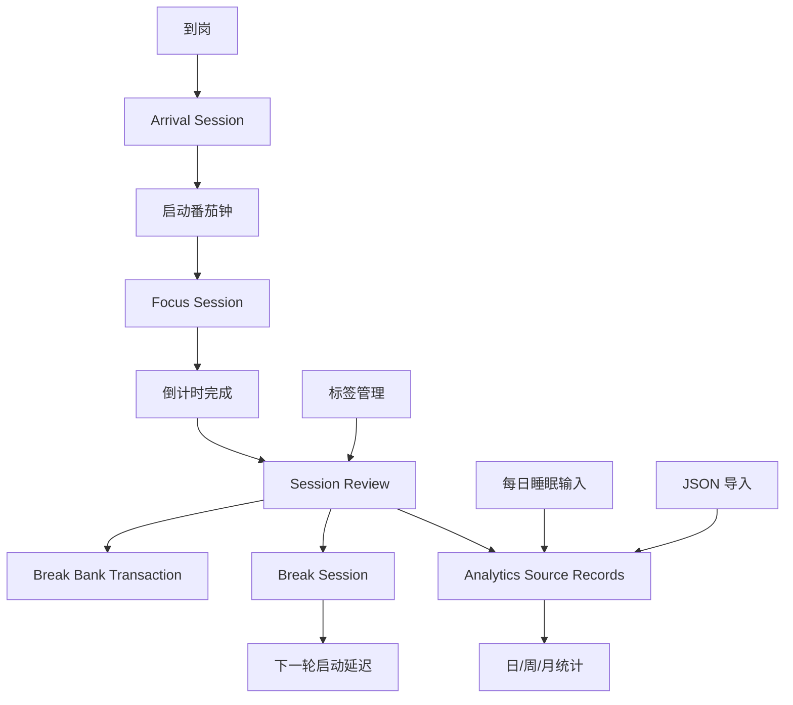

# Module Map

## 应用模块

| 模块 | 责任 | MVP 说明 |
| --- | --- | --- |
| Timer | 固定/自定义倒计时、开始、暂停、恢复、完成 | 只记录完成的专注时长；取消的计时可记录为草稿或废弃 |
| Arrival | 到岗记录、离开记录、启动延迟计算 | 到岗到第一轮学习开始之间是启动延迟 |
| Review | 每轮结束复盘表单 | 状态、注意力切换次数、产物、阻塞、休息选择 |
| Break Bank | 休息余额累计、休息倒计时和使用 | 每完成 25 分钟学习增加 5 分钟；使用休息后进入倒计时 |
| Labels | 标签管理 | 状态、产物、阻塞都用标签系统 |
| Sleep Log | 每日睡眠记录 | 每天唯一记录，可修改 |
| Analytics | 日/周/月统计 | 从原始记录计算学习时长、延迟、标签分布和日点阵 |
| Settings | 默认时长、标签配置、数据导出/导入 | 第一版只做必要设置 |
| Storage | 本地持久化、迁移、备份导出/导入 | 保持逻辑 schema 可迁移到 SQLite |
| Notification | 倒计时结束提醒 | 番茄钟结束和休息结束触发浏览器通知、默认提示音和页面内提示 |

## 当前实现状态

| 模块 | 状态 | 入口 |
| --- | --- | --- |
| Timer | 已实现 | `src/App.tsx`、`src/services/app-service.ts` |
| Arrival | 已实现 | `src/services/app-service.ts` |
| Review | 已实现 | `ReviewModal` in `src/App.tsx` |
| Break Bank | 已实现 | `src/domain/break-bank.ts`、`break_bank_transactions`、`break_sessions` |
| Labels | 已实现 | `LabelsView` in `src/App.tsx` |
| Sleep Log | 已实现 | `SleepPanel` in `src/App.tsx` |
| Analytics | 已实现 | `src/domain/analytics.ts`、`AnalyticsView` |
| Settings | 部分实现 | JSON 导出/导入、标签管理 |
| Storage | 已实现 | `src/storage/db.ts`、`src/storage/backup.ts` |
| Notification | 已实现 | `src/reminders.ts`、`notice` 状态 |
| Demo Data | 已实现 | 右上角“示例数据”按钮、`src/demo-data.ts` |

## 当前统计交互

- “日点阵”按 5 分钟一个点展示一天；每个点由内部 5 个 1 分钟状态的多数决定颜色。宽容器每列 30 分钟、窄容器每列 1 小时，避免统计页出现大片空白或轴文字过密。
- 点阵颜色：红色为启动延迟，绿色为正常学习，黄色为有阻塞或被打断的学习。
- 点阵支持前一天、后一天、今天和日期输入，因此可以持续查看昨天、前天或任意历史日期。
- “状态分布”“产物标签”“阻塞原因”饼图扇区和右侧标签列表都可点击。
- 点击后，下方“记录明细”只显示该状态、产物或阻塞标签关联的复盘记录。
- 点击其他标签会切换筛选。
- 点击“全部”会清除筛选，恢复全部复盘记录。

## 推荐页面结构

| 页面 | 目的 | 主要组件 |
| --- | --- | --- |
| Today | 日常使用主界面 | 到岗按钮、计时器、休息余额、今日摘要 |
| Review Modal | 倒计时结束后的复盘 | 状态选择、数字输入、标签选择、文本框 |
| Analytics | 统计复盘 | 日/周/月切换、趋势图、标签分布 |
| Sleep | 每日睡眠记录 | 15 分钟步进睡眠时长、精力步进评分、历史记录 |
| Labels | 标签管理 | 新增、重命名、隐藏、排序 |
| Settings | 偏好设置 | 默认番茄钟、数据导出/导入、清空数据确认 |

## 当前主界面布局

- 主界面采用 Focus Studio 方向：左侧固定导航和数据操作，右侧为主要工作区。
- Today 页面上方是专注倒计时和今日侧栏；今日侧栏包含摘要卡片和睡眠记录。
- Today 页面中部是完整宽度的日点阵，下方是最近记录。
- 最近记录支持按状态、产物标签、阻塞标签快速筛选。
- Analytics 页面保留日、周、月统计，点阵在宽屏下占满统计内容区。

## 数据流

## 核心组件边界

### Timer

- 只负责时间状态机。
- 不直接写统计。
- 完成时发出 `timer.completed` 事件或调用应用服务。

### Review

- 负责收集本轮人工输入。
- 必须和某个已完成的 focus session 绑定。
- 提交后本轮记录才算完整。

### Analytics

- 只读取源数据。
- 日/周/月统计应可重复计算。
- 如果后续加缓存表，缓存不能成为唯一真相。

### Labels

- 标签类型至少包括：
  - `session_status`
  - `product`
  - `blocker`
- 默认标签可保护，但用户应能新增自定义标签。
